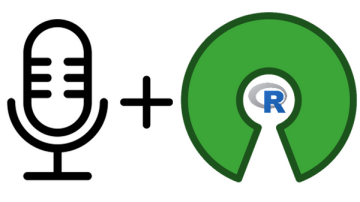
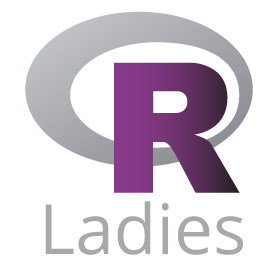
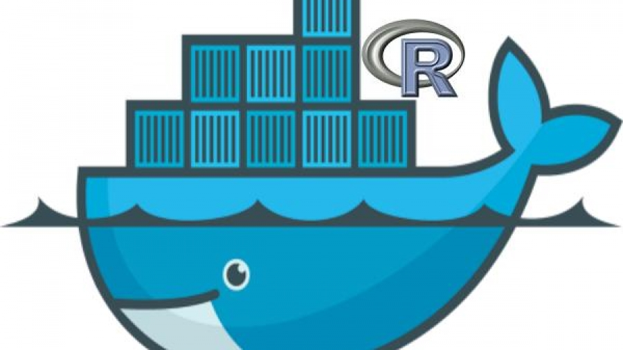
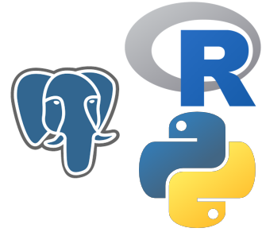
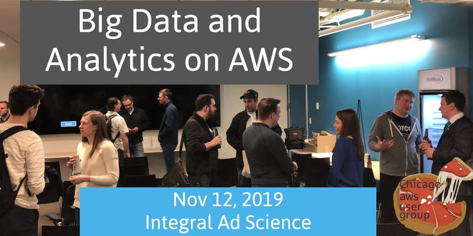
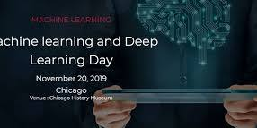
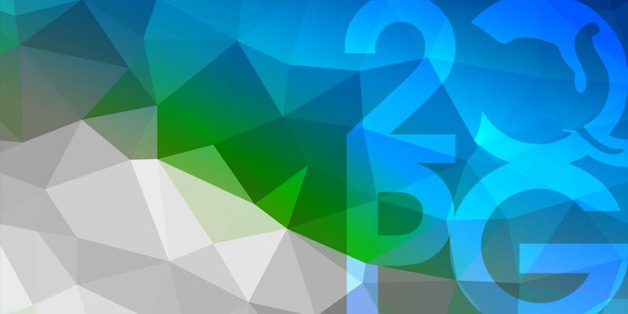
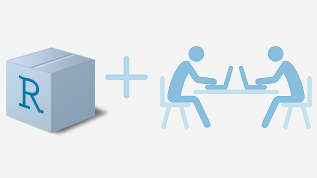

```{r setup, include=FALSE}
knitr::opts_chunk$set(echo = FALSE)
library(RUGtools)
```

## Chicago R User Group (CRUG) ...

- Welcome new and current useRs to 8th meetup of the year!
- We are The Chicago R User Group launched in 2010!
- Now reached 3,700 members, one of largest groups in world!
- We have an R package, [RUGTools](https://justinmshea.github.io/RUGtools/)!
- We even have a R Shiny app, [CRUG Attendance App](https://parfaitg.shinyapps.io/CRUG_Attendance_App/)!



## Find us:

**Slack**
 
[bit.ly/Slack-CRUG](http://bit.ly/Slack-CRUG)

**Twitter**

[ChicagoRusers](https://twitter.com/ChicagoRusers)

**GitHub**

@[Chicago-R-User-Group](https://github.com/Chicago-R-User-Group)

**Meetup**

[ChicagoRUG](https://www.meetup.com/ChicagoRUG/)

**Website**

[Chicago-r-user-group.github.io](https://chicago-r-user-group.github.io/)


# Upcoming Meetup Events

## 

**R Ladies – Hacktoberfest: Hack or Treat! October 29, 2019**
<br/>


**CRUG – Rocker Docker, November 2019**
<br/>


**Postgres User Group (PUG) – January 2020 **
<br/>
<br/>
[...](https://stackoverflow.com/help/badges/25/great-answer?userid=1422451)

# Local Tech News

## Big Data and Analytics on AWS


- Tuesday, November 12, 2019 at 5:30 PM
- Chicago AWS User Group
- Integral Ad Science<br/>1 North State Street, Suite 300<br/>Chicago, IL 60602
- Register at: [https://www.eventbrite.com/](https://www.eventbrite.com/e/big-data-and-analytics-on-aws-registration-75000768317?aff=ebdssbdestsearch)

## Machine Learning and Deep Learning Day


- Wednesday, November 20, 2019
- Chicago History Museum<br/>1601 N Clark St, Chicago, IL
- Register at: [https://www.eventbrite.com/](https://www.eventbrite.com/e/machine-learning-and-deep-learning-day-chicago-on-november-20-2019-tickets-74924714839)

## 2nd Quadrant Conference (2QPGConf)


- Decemeber 4-5, 2019, Chicago - City Center
- Includes 1-day of training and 1-day of talks
- https://www.2qpgconf.com/


# Anyone hiring R folks? 

# Tonight's Host/Sponsor

## 


Thanks Gogo for awesome space for tonight's meetup!

<br/>


Thanks IBM for sponsoring with food and beverages!


# Tonight's Event

## Single Package Lightning Talks



1. **Will Bonnell**, **ctar**: Package to interact with CTA train API.
https://github.com/willdebras/ctar

2. **James Lamb**, **uptasticsearch**: Data science-friendly dataframe client for Elasticsearch.
https://github.com/uptake/uptasticsearch

3. **Anh Tran**, **HPAanalyze** (of Bioconductor): Biological data visualization and access to a public dataset.
https://github.com/trannhatanh89/HPAanalyze

4. **Nick Reddell**, **forecastML**: Wrapper package that supports forecasting with non-time series ML methods.
https://github.com/nredell/forecastML


## Single Package Hacktoberfest


- **Group Workshops**: Led by William, James, Anh, and Nick
- **Brief Presentations**: Open to any Group


